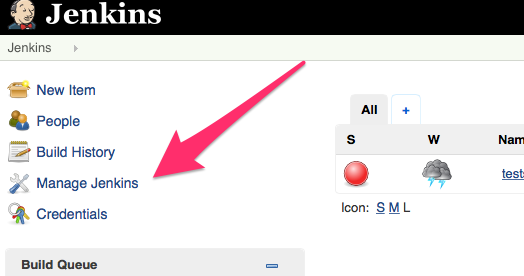
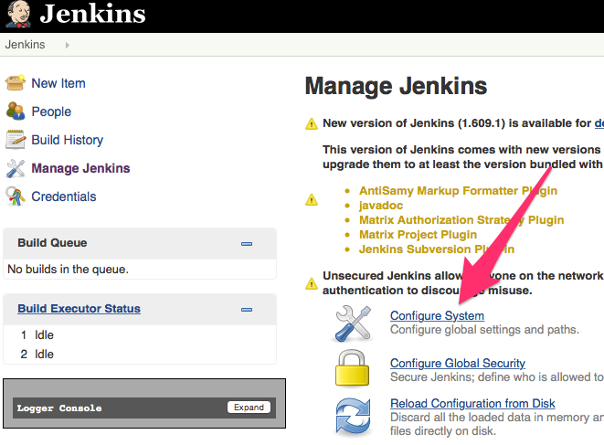
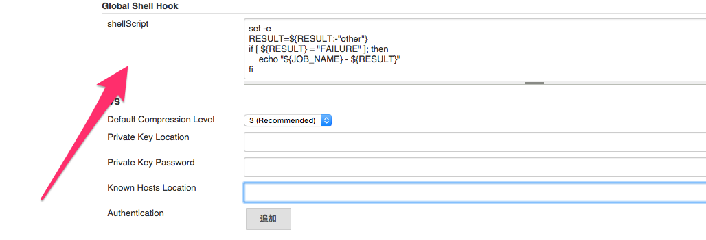

Global Shell Hook Plugin
=========

Jenkins Plugin for execute shell script after each jobs

## Requirement
java6 or above, maven

## build
```bash
$ mvn install
```
after that,  deploy ./target/pluginname.hpi to use with jenkins

## usage






### Licence
MIT License

